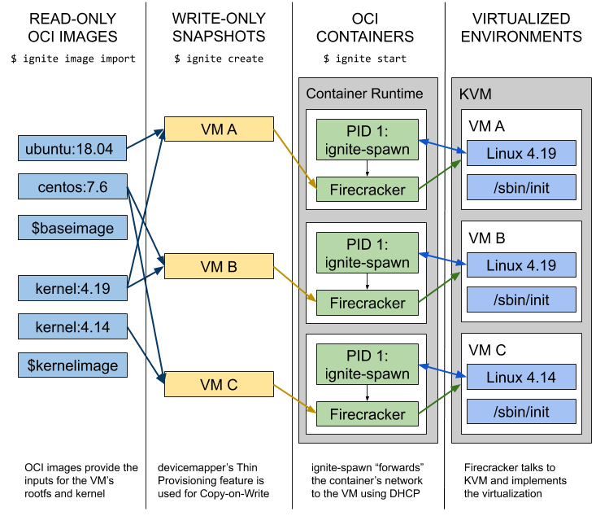

# Weave Ignite


Ignite is a Firecracker microVM administration tool, like Docker manages
runC containers.
It builds VM images from OCI images, spin VMs up/down in lightning speed,
and manages multiple VMs efficiently.

The idea is that Ignite makes Firecracker VMs look like Docker containers.
So we can deploy and manage full-blown VM systems just like e.g. Kubernetes workloads.
The images used are Docker images, but instead of running them in a container, the root
filesystem of the image executes as a real VM with a dedicated kernel and `/sbin/init` as
PID 1.

Networking is set up automatically, the VM gets the same IP as any docker
container on the host would.

And Firecracker is **fast**! Building and starting VMs takes just some _fraction of a second_, or
at most some seconds. With Ignite you can get started with Firecracker in no time!

## Use-cases

With Ignite, Firecracker is now much more accessible for end users, which means the ecosystem
can achieve the next level of momentum due to the easy onboarding path thanks to a docker-like UX.

Although Firecracker was designed with serverless workloads in mind, it can equally well boot a
normal Linux OS, like Ubuntu, Debian or CentOS, running an init system like `systemd`.

Having a super-fast way of spinning up a new VM, with a kernel of choice, running an init system
like `systemd` allows to run system-level applications like the kubelet, which needs to “own” the full system.

This allows for:
* Legacy applications which cannot be containerized (e.g. they need a specific kernel)
  * Alternative, a very new type of application requiring e.g. a custom kernel
* Reproducible, fast testing of system-wide programs (like Weave Net)
* Super fast Kubernetes Cluster Lifecycle with multiple machines (without docker hacks)
* A k8s-managed private VM cloud, on which a layer of k8s container clusters may run
* No need to run containers in VMs to combine container UX with VM security and isolation, Ignite combines both!

### Scope

If you want to run _applications_ in **containers** with added _Firecracker isolation_, use
[firecracker-containerd](https://github.com/firecracker-microvm/firecracker-containerd).
Or a similar solution like Kata Containers or gVisor, that are complementary to firecracker-containerd.

Firecracker Ignite, however, is operating at another layer. Ignite isn’t concerned with **containers**
as the primary unit, but whole yet lightweight VMs that integrate with the container landscape.

## Installing

Please check out the [Releases Page](https://github.com/weaveworks/ignite/releases).

How to install Ignite is covered in [docs/installation.md](docs/installation.md).

## Getting Started

**WARNING**: In it's `v0.X` series, Ignite is in **alpha**, which means that it might change in backwards-incompatible ways.

[](https://asciinema.org/a/252221)

Note: At the moment `ignite` needs root privileges on the host to operate,
for certain specific operations (e.g. `mount`). This will change in the future.

```bash
# Let's run the weaveworks/ignite-ubuntu docker image as a VM
# Use 2 vCPUs and 1GB of RAM, enable automatic SSH access and name it my-vm
ignite run weaveworks/ignite-ubuntu \
    --cpus 2 \
    --memory 1GB \
    --ssh \
    --name my-vm

# List running VMs
ignite ps

# List Docker (OCI) and kernel images imported into Ignite
ignite images
ignite kernels

# Get the boot logs of the VM
ignite logs my-vm

# SSH into the VM
ignite ssh my-vm

# Inside the VM you can check that the kernel version is different, and the IP address came from the Docker bridge
# Also the memory is limited to what you specify, as well as the vCPUs
> uname -a
> ip addr
> free -m
> cat /proc/cpuinfo

# Rebooting the VM tells Firecracker to shut it down
> reboot

# Cleanup
ignite rm my-vm
```

For a walkthrough of how to use Ignite, go to **[docs/usage.md]**(docs/usage.md).

### Documentation

Please refer to the:

- [Getting Started Walkthrough](docs/usage.md)
- [Declaratively Controlling Ignite](docs/declarative-config.md)
- [CLI Reference](docs/cli/ignite.md)
- [API Reference](api)
- [Scope and Requirements](docs/REQUIREMENTS.md)

### Architecture



### Base images and kernels

A _base image_ is an OCI-compliant image containing some operating system (e.g. Ubuntu).
You can follow normal `docker build` patterns for customizing your VM's rootfs.

A _kernel image_ is an OCI-compliant image containing a `/boot/vmlinux` (an uncompressed kernel)
executable (can be a symlink). You can also put supporting kernel modules in `/lib/modules`
if needed. You can match and mix any kernel and any base image.

As the upstream `centos:7` and `ubuntu:18.04` images from Docker Hub doesn't
have all the utilities and packages you'd expect in a VM (e.g. an init system), we have packaged some
reference base images and a sample kernel image to get started quickly.

 - [Kernel Builder Image](images/kernel/Dockerfile) (`weaveworks/ignite-centos`)
 - [Ubuntu 18.04 Dockerfile](images/ubuntu/Dockerfile) (`weaveworks/ignite-ubuntu`)
 - [CentOS 7 Dockerfile](images/ubuntu/Dockerfile) (`weaveworks/ignite-kernel`)
 - [Guide: Run a HA Kubernetes cluster with Ignite and kubeadm](images/kubeadm) (`weaveworks/ignite-kubeadm`)

These prebuilt images can be given to `ignite run` directly.

## Contributing

Please see [CONTRIBUTING.md](CONTRIBUTING.md) and our [Code Of Conduct](CODE_OF_CONDUCT.md).

Other interesting resources include:
 - [The issue tracker](https://github.com/weaveworks/ignite/issues)
 - [The list of milestones](https://github.com/weaveworks/ignite/milestones)
 - [CHANGELOG.md](CHANGELOG.md)
 - [ROADMAP.md](ROADMAP.md)

## Getting Help

If you have any questions about, feedback for or problems with `ignite`:

- Invite yourself to the <a href="https://slack.weave.works/" target="_blank">Weave Users Slack</a>.
- Ask a question on the [#general](https://weave-community.slack.com/messages/general/) slack channel.
- [File an issue](https://github.com/weaveworks/ignite/issues/new).

Your feedback is always welcome!

## Maintainers

- Lucas Käldström, [@luxas](https://github.com/luxas)
- Dennis Marttinen, [@twelho](https://github.com/twelho)

## License

[Apache 2.0](LICENSE)
